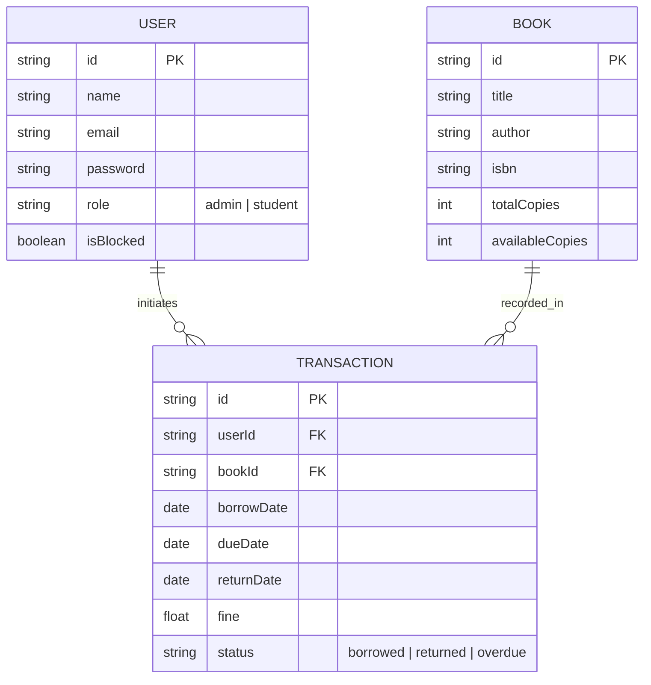

# 📚 Library Management System (SaaS) - Project Report

---

## 1. Project Overview
The **Library Management System** is a modern, production-grade SaaS platform designed to automate library operations for colleges and institutions. It provides a seamless experience for both administrators and students, featuring secure authentication, real-time book tracking, and automated fine management.

### 🎯 Key Objectives
- **Digital Transformation**: Moving traditional library logs to a secure cloud-based system.
- **Automated Operations**: Automating book issuance, returns, and overdue fine calculations.
- **User Accountability**: Real-time tracking of borrowed books and student history.

---

## 2. Technical Stack
The system is built using the **MERN Stack** (with TypeScript) for maximum performance and scalability.

| Layer | Technology |
| :--- | :--- |
| **Frontend** | React.js, TypeScript, Vite, TailwindCSS, Framer Motion |
| **Backend** | Node.js, Express.js, TypeScript |
| **Database** | MongoDB (NoSQL) with Mongoose ODM |
| **Authentication** | JWT (JSON Web Tokens) with HttpOnly Cookies |
| **Deployment** | Vercel (Frontend) & Render (Backend) |

---

## 3. System Architecture
The project follows a **Modular MVC (Model-View-Controller)** architecture to ensure clean separation of concerns.

### 🏗️ Design Patterns Used
- **Singleton Pattern**: Ensures a single database connection pool throughout the application lifecycle.
- **Repository Pattern**: Abstracts data access logic for easier testing and maintenance.
- **Middleware Pattern**: Used for centralized error handling, authentication, and rate limiting.

---

## 4. Core Features

### 👨‍💼 Administrator Features
- **Dashboard**: Real-time statistics on books, users, and overdue transactions.
- **Book Management**: CRUD operations for the library catalog.
- **User Management**: Ability to block/unblock students and track their activity.
- **Transaction Oversight**: Viewing all active borrowings and manual return processing.

### 👨‍🎓 Student Features
- **Personal Dashboard**: View currently borrowed books and return deadlines.
- **History Tracking**: Complete log of past borrowings and paid/unpaid fines.
- **Book Discovery**: Search and browse the library catalog with real-time availability status.

---

## 5. Security & Performance
- **Secure Auth**: Uses secure refresh token rotation and HttpOnly cookies to prevent XSS/CSRF.
- **Rate Limiting**: Protects the API from brute-force attacks.
- **Optimized Caching**: Uses `node-cache` for frequent queries to reduce database load.
- **Skeleton Loaders**: Provides a premium UX by showing loading states during data fetching.

---

## 6. Database Design (ER Diagram)
The system uses a highly optimized schema to track relationships between Users, Books, and Transactions.

## 7. Deployment Configuration

The system is optimized for a distributed deployment:

- **Backend**: Hosted on Render as a Node.js Web Service.
- **Frontend**: Hosted on Vercel for high-performance static delivery.
- **Environment Management**: Fully decoupled configuration via `.env` variables for different environments.

---

## 8. Conclusion

The **Library Management System (SaaS)** successfully delivers a robust, secure, and user-friendly platform for modern educational institutions. Its scalable architecture and automated features significantly reduce administrative overhead while providing students with a transparent and efficient borrowing experience.

---

## 👥 Team

The project was developed through a collaborative effort, with each member contributing specialized expertise:

| Role | Contributor | Responsibilities |
|------|------------|------------------|
| **Full Stack Developer** | Akash Kumar Gautam | End-to-end development, system integration, architecture implementation |
| **Frontend Developer** | Ansh Sharma | UI/UX design, responsive frontend development |
| **Backend Developer** | Rahul Kumar Diwedi | API development, business logic, authentication |
| **Database & Architecture** | Harender Chhoker | Database schema design, system architecture |
| **Testing & Documentation** | Lakshya | Testing, debugging, and documentation |
