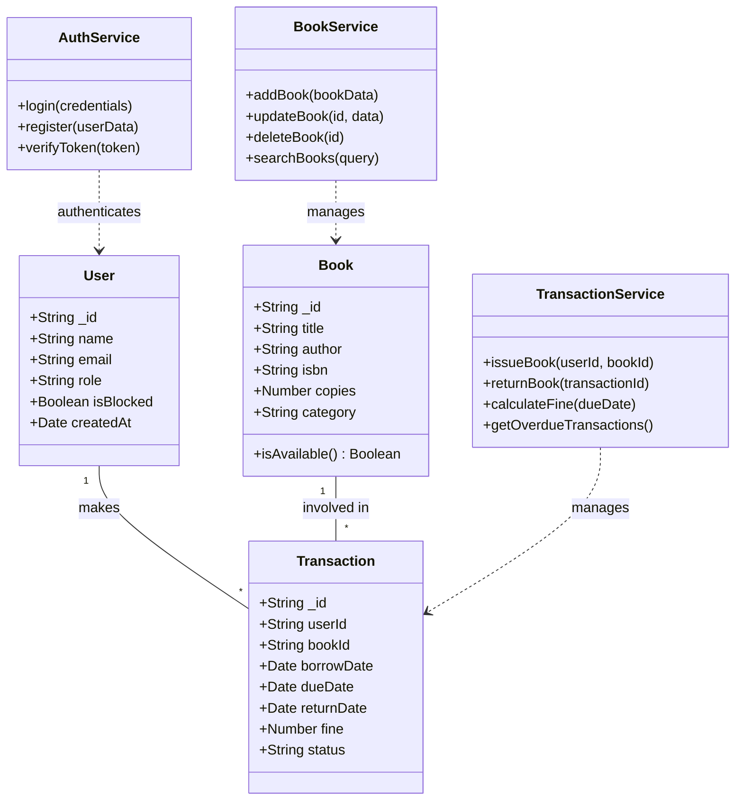
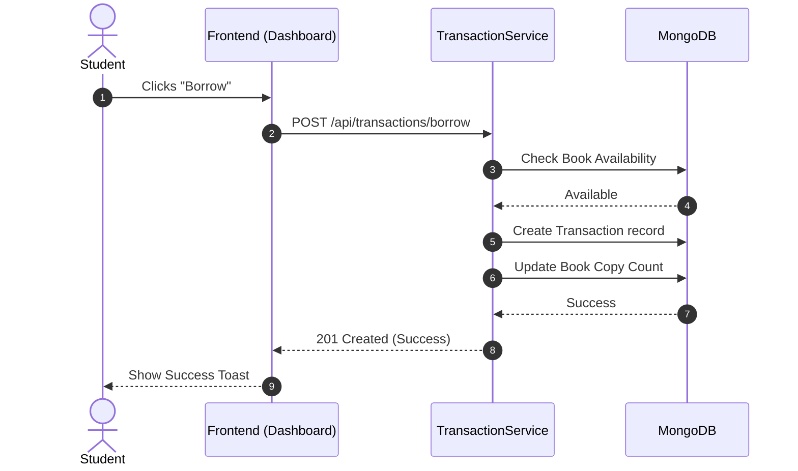
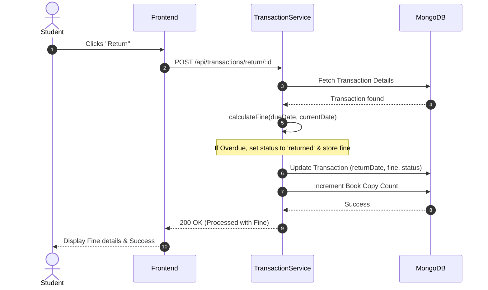
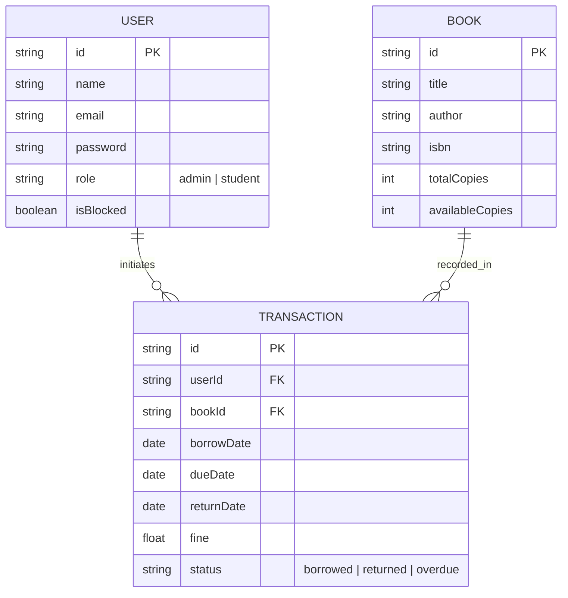

# 🏛️ Library Management System (SaaS) - Architecture Documentation

This document contains professional UML diagrams representing the architecture and design of the SaaS-based Library Management System.

---

## 1. Class Diagram
Represents the system's static structure, including entities and services.



---

## 2. Use Case Diagram
Describes the functional requirements and actor interactions.

```mermaid
useCaseDiagram
    actor Student
    actor Admin

    package "Library Management System" {
        usecase "Browse & Search Books" as UC1
        usecase "Borrow Book" as UC2
        usecase "Return Book" as UC3
        usecase "View Personal History & Fines" as UC4
        usecase "Manage Books (CRUD)" as UC5
        usecase "Manage Users" as UC6
        usecase "View Admin Dashboard" as UC7
        usecase "Manage Overdue & Fines" as UC8
        usecase "View All Transactions" as UC9
    }

    Student --> UC1
    Student --> UC2
    Student --> UC3
    Student --> UC4

    Admin --> UC5
    Admin --> UC6
    Admin --> UC7
    Admin --> UC8
    Admin --> UC9
```

---

## 3. Sequence Diagram
Illustrates the logic flow for borrowing and returning books.

### Borrowing Flow


### Returning Flow (with Fine)


---

## 4. Entity-Relationship (ER) Diagram
Defines the database schema and data relationships.


