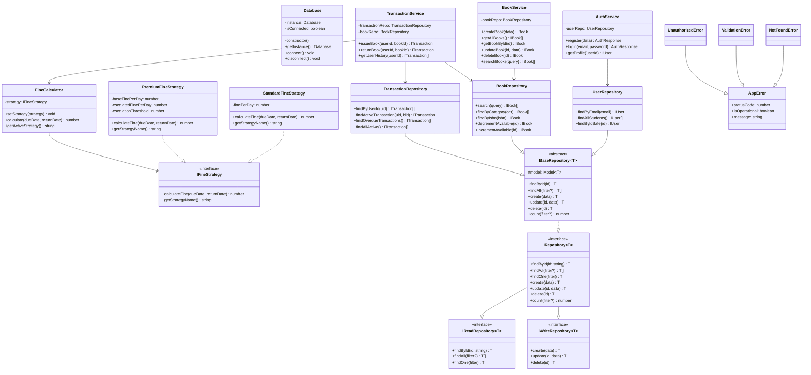
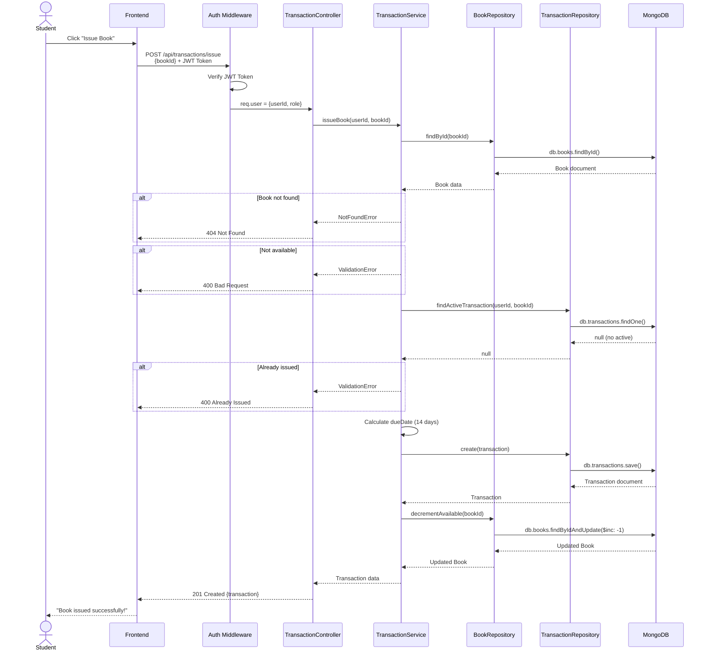
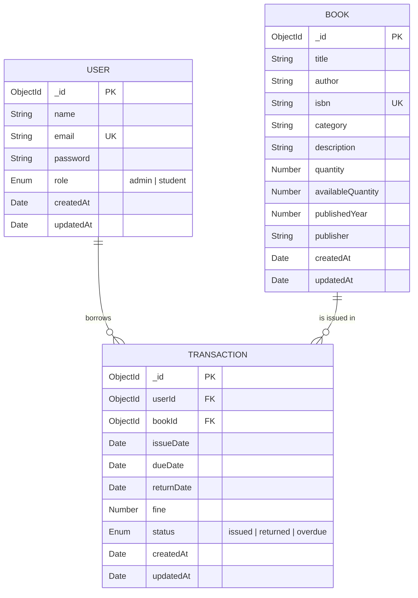

# UML Diagrams - Library Management System

## 1. Class Diagram

```mermaid
classDiagram
    class IRepository~T~ {
        <<interface>>
        +findById(id: string) T
        +findAll(filter?) T[]
        +findOne(filter) T
        +create(data) T
        +update(id, data) T
        +delete(id) T
        +count(filter?) number
    }

    class IReadRepository~T~ {
        <<interface>>
        +findById(id: string) T
        +findAll(filter?) T[]
        +findOne(filter) T
    }

    class IWriteRepository~T~ {
        <<interface>>
        +create(data) T
        +update(id, data) T
        +delete(id) T
    }

    class IFineStrategy {
        <<interface>>
        +calculateFine(dueDate, returnDate) number
        +getStrategyName() string
    }

    class BaseRepository~T~ {
        <<abstract>>
        #model: Model~T~
        +findById(id) T
        +findAll(filter?) T[]
        +create(data) T
        +update(id, data) T
        +delete(id) T
        +count(filter?) number
    }

    class UserRepository {
        +findByEmail(email) IUser
        +findAllStudents() IUser[]
        +findByIdSafe(id) IUser
    }

    class BookRepository {
        +search(query) IBook[]
        +findByCategory(cat) IBook[]
        +findByIsbn(isbn) IBook
        +decrementAvailable(id) IBook
        +incrementAvailable(id) IBook
    }

    class TransactionRepository {
        +findByUserId(uid) ITransaction[]
        +findActiveTransaction(uid, bid) ITransaction
        +findOverdueTransactions() ITransaction[]
        +findAllActive() ITransaction[]
    }

    class StandardFineStrategy {
        -finePerDay: number
        +calculateFine(dueDate, returnDate) number
        +getStrategyName() string
    }

    class PremiumFineStrategy {
        -baseFinePerDay: number
        -escalatedFinePerDay: number
        -escalationThreshold: number
        +calculateFine(dueDate, returnDate) number
        +getStrategyName() string
    }

    class FineCalculator {
        -strategy: IFineStrategy
        +setStrategy(strategy) void
        +calculate(dueDate, returnDate) number
        +getActiveStrategy() string
    }

    class Database {
        -instance: Database
        -isConnected: boolean
        -constructor()
        +getInstance() Database
        +connect() void
        +disconnect() void
    }

    class AuthService {
        -userRepo: UserRepository
        +register(data) AuthResponse
        +login(email, password) AuthResponse
        +getProfile(userId) IUser
    }

    class BookService {
        -bookRepo: BookRepository
        +createBook(data) IBook
        +getAllBooks() IBook[]
        +getBookById(id) IBook
        +updateBook(id, data) IBook
        +deleteBook(id) IBook
        +searchBooks(query) IBook[]
    }

    class TransactionService {
        -transactionRepo: TransactionRepository
        -bookRepo: BookRepository
        +issueBook(userId, bookId) ITransaction
        +returnBook(userId, bookId) ITransaction
        +getUserHistory(userId) ITransaction[]
    }

    class AppError {
        +statusCode: number
        +isOperational: boolean
        +message: string
    }

    class NotFoundError
    class ValidationError
    class UnauthorizedError

    IRepository~T~ --|> IReadRepository~T~
    IRepository~T~ --|> IWriteRepository~T~
    BaseRepository~T~ ..|> IRepository~T~
    UserRepository --|> BaseRepository~T~
    BookRepository --|> BaseRepository~T~
    TransactionRepository --|> BaseRepository~T~
    StandardFineStrategy ..|> IFineStrategy
    PremiumFineStrategy ..|> IFineStrategy
    FineCalculator --> IFineStrategy
    NotFoundError --|> AppError
    ValidationError --|> AppError
    UnauthorizedError --|> AppError
    AuthService --> UserRepository
    BookService --> BookRepository
    TransactionService --> TransactionRepository
    TransactionService --> BookRepository
    TransactionService --> FineCalculator
```

## 2. Use Case Diagram

```mermaid
graph TB
    subgraph "Library Management System"
        UC1["🔐 Register"]
        UC2["🔐 Login"]
        UC3["📖 Browse Books"]
        UC4["🔍 Search Books"]
        UC5["📋 View Book Details"]
        UC6["📖 Issue Book"]
        UC7["↩️ Return Book"]
        UC8["📋 View Borrowing History"]
        UC9["➕ Add Book"]
        UC10["✏️ Update Book"]
        UC11["🗑️ Delete Book"]
        UC12["📊 View Dashboard"]
        UC13["👥 Manage Users"]
        UC14["⚠️ View Overdue Books"]
        UC15["💰 Calculate Fine"]
    end

    Student["👨‍🎓 Student"]
    Admin["👨‍💼 Admin"]

    Student --> UC1
    Student --> UC2
    Student --> UC3
    Student --> UC4
    Student --> UC5
    Student --> UC6
    Student --> UC7
    Student --> UC8

    Admin --> UC2
    Admin --> UC3
    Admin --> UC4
    Admin --> UC5
    Admin --> UC9
    Admin --> UC10
    Admin --> UC11
    Admin --> UC12
    Admin --> UC13
    Admin --> UC14

    UC7 --> UC15

    style Student fill:#06b6d4,stroke:#0891b2,color:#fff
    style Admin fill:#f59e0b,stroke:#d97706,color:#fff
```

## 3. Sequence Diagram - Book Issue Flow

```mermaid
sequenceDiagram
    actor Student
    participant Frontend
    participant AuthMW as Auth Middleware
    participant Controller as TransactionController
    participant Service as TransactionService
    participant BookRepo as BookRepository
    participant TxnRepo as TransactionRepository
    participant DB as MongoDB

    Student->>Frontend: Click "Issue Book"
    Frontend->>AuthMW: POST /api/transactions/issue<br/>{bookId} + JWT Token

    AuthMW->>AuthMW: Verify JWT Token
    AuthMW->>Controller: req.user = {userId, role}

    Controller->>Service: issueBook(userId, bookId)

    Service->>BookRepo: findById(bookId)
    BookRepo->>DB: db.books.findById()
    DB-->>BookRepo: Book document
    BookRepo-->>Service: Book data

    alt Book not found
        Service-->>Controller: NotFoundError
        Controller-->>Frontend: 404 Not Found
    end

    alt Not available
        Service-->>Controller: ValidationError
        Controller-->>Frontend: 400 Bad Request
    end

    Service->>TxnRepo: findActiveTransaction(userId, bookId)
    TxnRepo->>DB: db.transactions.findOne()
    DB-->>TxnRepo: null (no active)
    TxnRepo-->>Service: null

    alt Already issued
        Service-->>Controller: ValidationError
        Controller-->>Frontend: 400 Already Issued
    end

    Service->>Service: Calculate dueDate (14 days)

    Service->>TxnRepo: create(transaction)
    TxnRepo->>DB: db.transactions.save()
    DB-->>TxnRepo: Transaction document
    TxnRepo-->>Service: Transaction

    Service->>BookRepo: decrementAvailable(bookId)
    BookRepo->>DB: db.books.findByIdAndUpdate($inc: -1)
    DB-->>BookRepo: Updated Book
    BookRepo-->>Service: Updated Book

    Service-->>Controller: Transaction data
    Controller-->>Frontend: 201 Created {transaction}
    Frontend-->>Student: "Book issued successfully!"
```

## 4. ER Diagram

```mermaid
erDiagram
    USER {
        ObjectId _id PK
        String name
        String email UK
        String password
        Enum role "admin | student"
        Date createdAt
        Date updatedAt
    }

    BOOK {
        ObjectId _id PK
        String title
        String author
        String isbn UK
        String category
        String description
        Number quantity
        Number availableQuantity
        Number publishedYear
        String publisher
        Date createdAt
        Date updatedAt
    }

    TRANSACTION {
        ObjectId _id PK
        ObjectId userId FK
        ObjectId bookId FK
        Date issueDate
        Date dueDate
        Date returnDate
        Number fine
        Enum status "issued | returned | overdue"
        Date createdAt
        Date updatedAt
    }

    USER ||--o{ TRANSACTION : "borrows"
    BOOK ||--o{ TRANSACTION : "is issued in"
```
