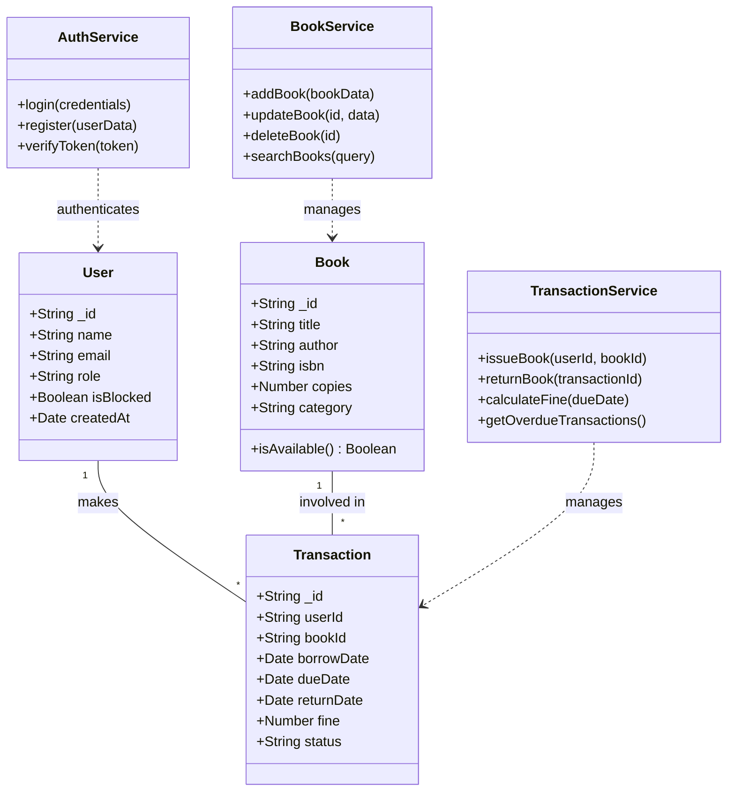
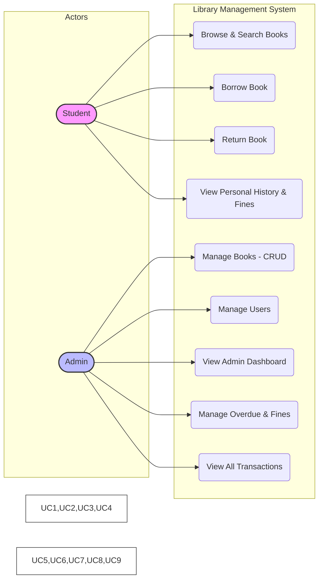
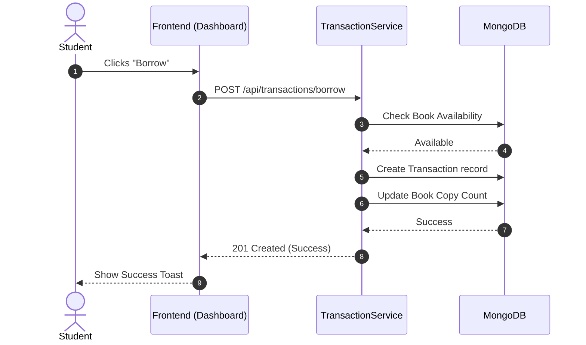
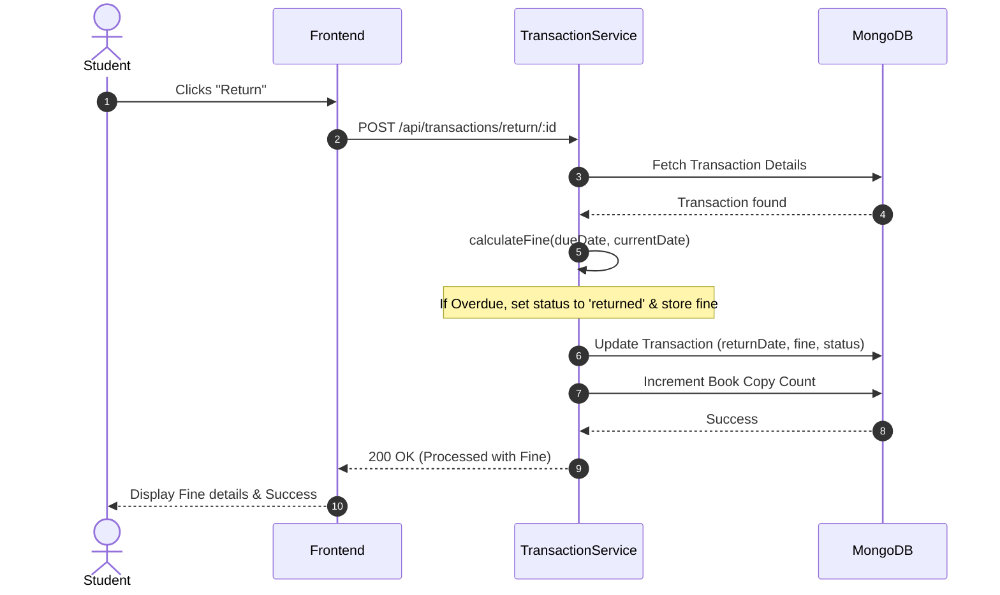
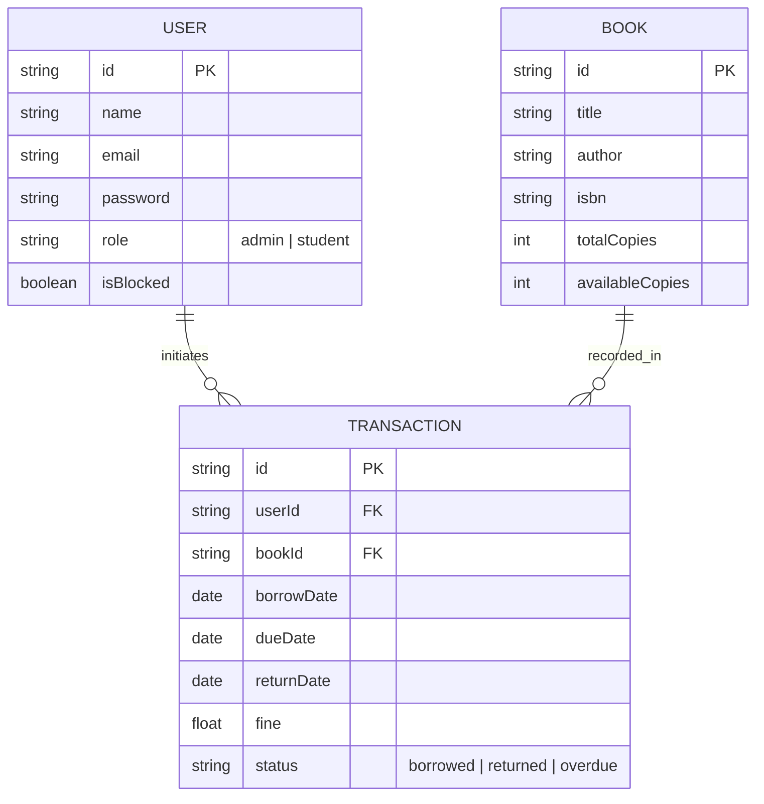

# 🏛️ Library Management System (SaaS) - Architecture Documentation

This document contains professional UML diagrams representing the architecture and design of the SaaS-based Library Management System.

---

## 1. Class Diagram
Represents the system's static structure, including entities and services.

---

## 2. Use Case Diagram
Describes the functional requirements and actor interactions (GitHub Compatible).

---

## 3. Sequence Diagram
Illustrates the logic flow for borrowing and returning books.

### Borrowing Flow

### Returning Flow (with Fine)

---

## 4. Entity-Relationship (ER) Diagram
Defines the database schema and data relationships.

